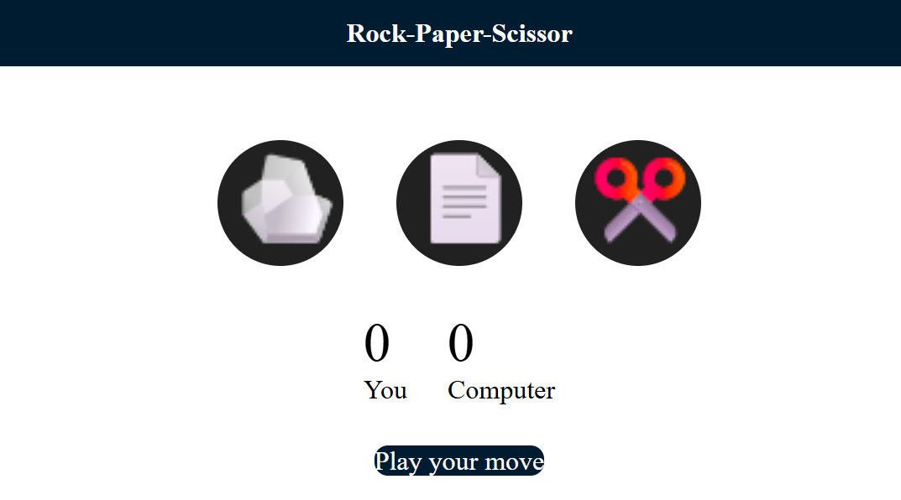

# Rock-Paper-Scissor Game

A simple Rock-Paper-Scissors game built with HTML, CSS, and vanilla JavaScript. Choose rock, paper, or scissors and play against the computer while the scoreboard tracks the results.

## Preview



## Features

- Play Rock-Paper-Scissors against a computer opponent.
- Random computer move generation for every round.
- Live user and computer score updates.
- Draw, win, and loss messages after each move.
- Responsive, image-based choice buttons with hover feedback.

## Getting Started

### Requirements

No build tools, package manager, or external dependencies are required. A modern web browser is all that is needed.

### Run the game

1. Clone or download this repository.
2. Open `index.html` in a web browser.
3. Click one of the three choices to play a round.

For a more reliable local serving experience, start any static file server from the project directory and open the address it provides. For example, with Python installed:

```bash
python -m http.server
```

Then visit `http://localhost:8000` in your browser.

## How to Play

1. Select **Rock**, **Paper**, or **Scissors**.
2. The computer selects a move at random.
3. The result is shown below the scoreboard.
4. The winner's score increases; equal moves count as a draw.

The game follows the standard rules:

- Rock beats Scissors.
- Scissors beats Paper.
- Paper beats Rock.

## Project Structure

```text
.
├── index.html       # Game markup and layout
├── index.css        # Styling and page layout
├── script.js        # Game logic and score handling
├── rock.png         # Rock choice image
├── paper.png        # Paper choice image
├── scissors.png    # Scissors choice image
└── game-preview.png # Attached webpage preview
```

## Technologies

- HTML5
- CSS3
- JavaScript

## License

This project is available for personal and educational use.
